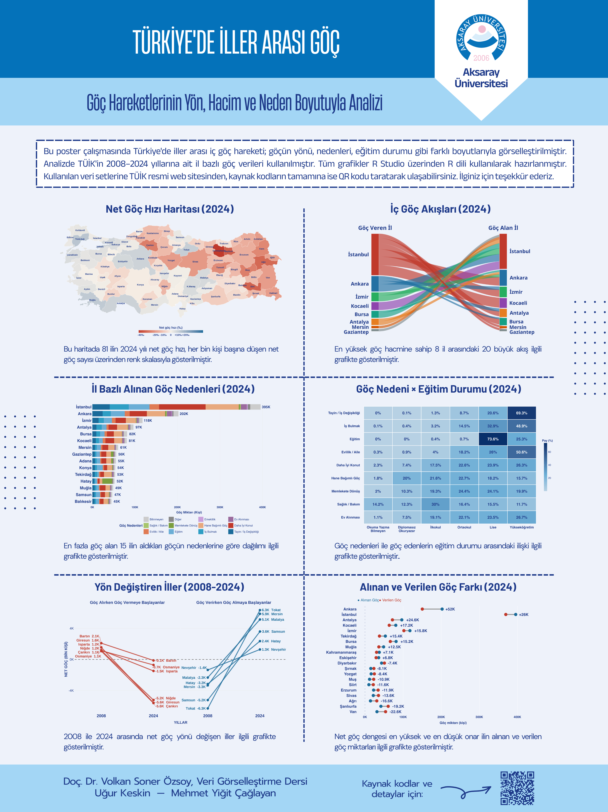

# 🗺️ Türkiye'de İller Arası Göç — Veri Görselleştirme Posteri

> Türkiye'de iç göç hareketlerinin yön, hacim ve neden boyutuyla R Studio ortamında görselleştirildiği akademik bir poster çalışması.

---

## 📌 Poster Önizleme



---

## 📖 Hakkında

Bu çalışmada Türkiye'de iller arası iç göç hareketi; göçün yönü, nedenleri ve eğitim durumu gibi farklı boyutlarıyla görselleştirilmiştir. Analizde TÜİK'in **2008–2024** yıllarına ait il bazlı göç verileri kullanılmıştır. Tüm grafikler **R Studio** üzerinden **R dili** kullanılarak hazırlanmıştır.

---

## 📊 İçerdiği Görselleştirmeler

- 🗺️ **Net Göç Hızı Haritası (2024)** — 81 ilin net göç hızı, her bin kişi başına düşen net göç sayısı üzerinden renk skalasıyla gösterilmiştir
- 🔀 **İç Göç Akışları (2024)** — En yüksek göç hacmine sahip 8 il arasındaki 20 büyük akışı gösteren Sankey diyagramı
- 📊 **İl Bazlı Alınan Göç Nedenleri (2024)** — En fazla göç alan 15 ilin aldıkları göçün nedenlerine göre dağılımı
- 🎓 **Göç Nedeni × Eğitim Durumu (2024)** — Göç nedenleri ile göç edenlerin eğitim durumu arasındaki ilişki
- 📈 **Yön Değiştiren İller (2008–2024)** — 2008 ile 2024 arasında net göç yönü değişen iller
- ⚖️ **Alınan ve Verilen Göç Farkı (2024)** — Net göç dengesi en yüksek ve en düşük onar ilin karşılaştırması

---

## 🛠️ Kullanılan Teknolojiler

| Araç | Kullanım Amacı |
|------|----------------|
| **R** | Veri analizi ve görselleştirme |
| **ggplot2** | Grafik oluşturma |
| **sf / ggmap** | Harita görselleştirme |
| **networkD3 / ggalluvial** | Sankey / akış diyagramı |
| **dplyr / tidyr** | Veri düzenleme |
| **R Studio** | Geliştirme ortamı |

---

## 📁 Proje Yapısı

```
goc-posteri/
│
├── data/
│   └── tuik_goc_2008_2024.csv     # TÜİK kaynaklı ham veri
│
├── scripts/
│   ├── 01_harita.R                # Net göç hızı haritası
│   ├── 02_sankey.R                # İç göç akışları
│   ├── 03_neden_bar.R             # İl bazlı göç nedenleri
│   ├── 04_egitim_neden.R          # Göç nedeni × eğitim durumu
│   ├── 05_yon_degistiren.R        # Yön değiştiren iller
│   └── 06_fark_grafigi.R          # Alınan-verilen göç farkı
│
├── output/
│   └── poster_preview.png         # Hazır poster görseli
│
└── README.md
```

---

## 🗃️ Veri Kaynağı

Kullanılan veri setleri **TÜİK (Türkiye İstatistik Kurumu)** resmi web sitesinden alınmıştır.

🔗 [TÜİK — İl Göç İstatistikleri](https://www.tuik.gov.tr)

---

## ▶️ Çalıştırma

```r
# Gerekli paketleri yükle
install.packages(c("ggplot2", "sf", "dplyr", "tidyr", "ggalluvial", "networkD3"))

# Script'leri sırasıyla çalıştır
source("scripts/01_harita.R")
source("scripts/02_sankey.R")
source("scripts/03_neden_bar.R")
source("scripts/04_egitim_neden.R")
source("scripts/05_yon_degistiren.R")
source("scripts/06_fark_grafigi.R")
```

---

## 👨‍💻 Hazırlayanlar

<table>
  <tr>
    <td align="center">
      <b>Doç. Dr. Volkan Soner Özsoy</b><br/>
      <sub>Veri Görselleştirme Dersi</sub>
    </td>
    <td align="center">
      <a href="https://github.com/yigitcaglayan">
        <br/>
        <sub><b>Mehmet Yiğit Çağlayan</b></sub>
      </a>
    </td>
    <td align="center">
      <b>Uğur Keskin</b>
    </td>
  </tr>
</table>

---

## 📄 Lisans

Bu proje [MIT Lisansı](LICENSE) ile lisanslanmıştır. Kaynak kodlara ve detaylara poster üzerindeki QR kod aracılığıyla da ulaşabilirsiniz.
